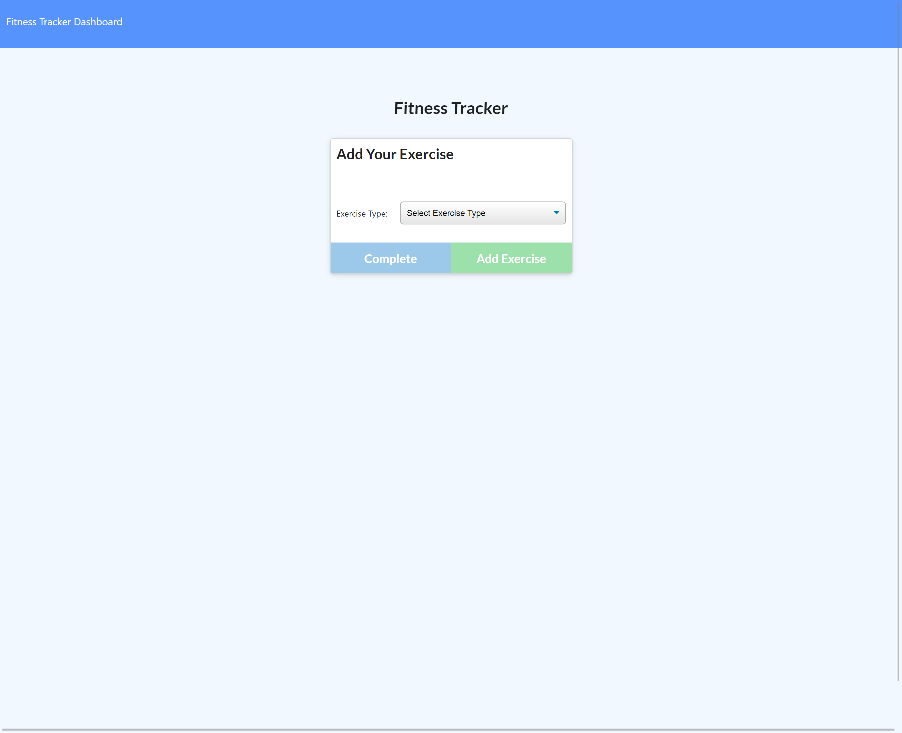
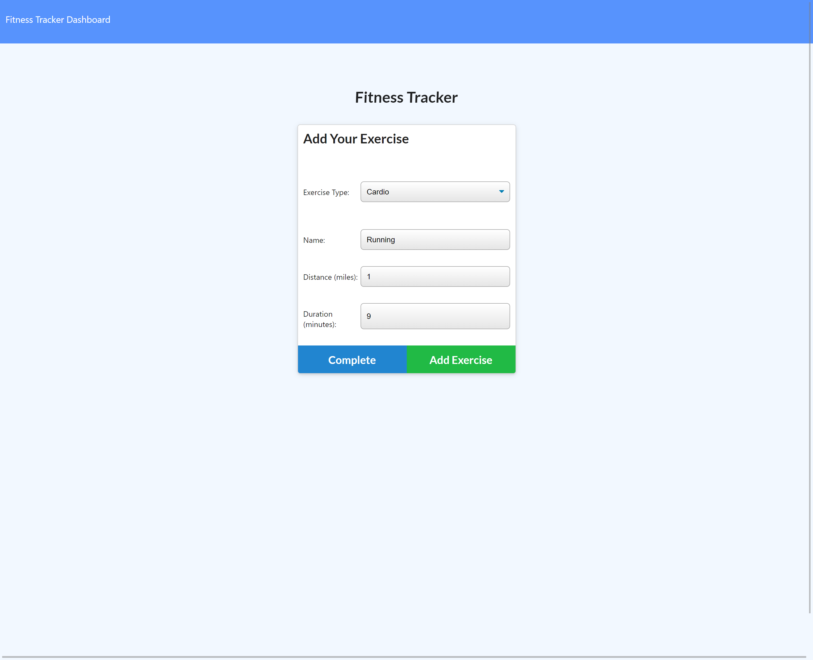
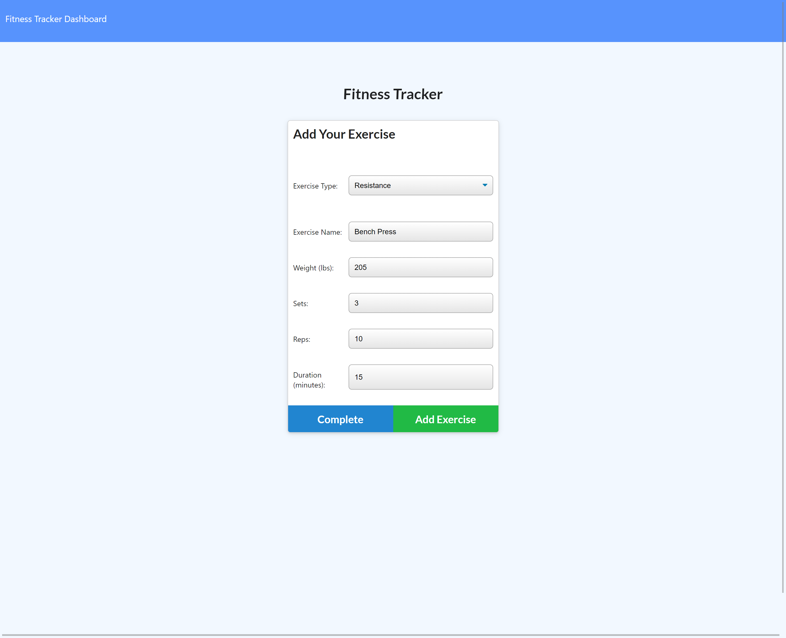
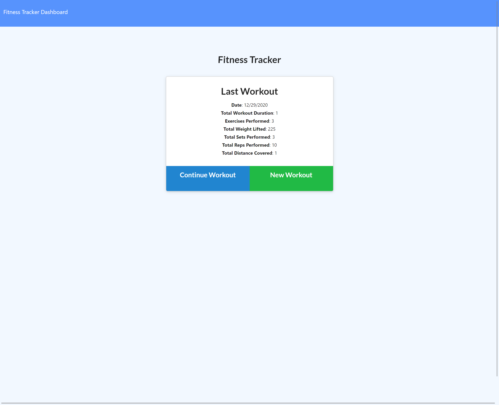

# FitnessTracker

## Description

The task this week was to create a Fitness Tracker to allow a user to be able to track their daily workouts by inputing specific information about their workouts and exercises. The benefits of logging and tracking
makes it more likely that the user will reach and surpass their goal. It allows the user to be more efficient with their time and workouts. It lends accountability to the user and their goals. Finally, it allows for easier modifications and shows when and where changes need to be made. The Fitness Tracker is of great importance for any user and will certainly make their life easier and get them on the right track to reaching their ultimate fitness goals!!

## User Story

```
As a user, I want to be able to view create and track daily workouts. I want to be able to log multiple exercises in a workout on a given day. I should also be able to track the name, type, weight, sets, reps, and duration of exercise. If the exercise is a cardio exercise, I should be able to track my distance traveled.
```

## Table of Contents

* [Usage](#usage)

* [Contributing](#Contributing)

* [Heroku Link](#heroku)

* [ScreenShots of Completed App](#screenshots)

* [Contact](#contact)

## Usage

The main purpose of this app is to allow a user to be able to view, create, and track daily workouts. They will be able to log mulitple exercises and can track them by name, type, weight, sets, reps, and duration of the exercise. If the user does cardio they will also be able to track the distance traveled. Upon loading the page user will have the option to create new workout or continue with their last workout. Allowing the user to keep track of their workout will make life easier for them!!

## Contributing

If you are interested in contributing to this app please contact the owner of this repo via email. If given approval please follow these steps:

* Fork this repository.
* Create a branch: git checkout -b <branch_name>.
* Make your changes and commit them: git commit -m '<commit_message>'
* Push to the original branch: git push origin <project_name>/<location>
* Create the pull request.

Alternatively see the GitHub documentation on [creating a pull request](https://docs.github.com/en/free-pro-team@latest/github/collaborating-with-issues-and-pull-requests/creating-a-pull-request).

## Heroku

Please check out the following link to see the finished product:

[Deployed App](https://dm-fit-app.herokuapp.com/)

## ScreenShots

Add Exercise


Example of Cardio Exercise


Example of Resistance Exercise


Recap of Last Workout Completed


## Contact
If you have any questions regarding this project and would like to reach out to me please feel free to do so at the following email: dimitarm01@gmail.com. Thank you.

Check Out My Github Page:
[Github](https://github.com/dspark8916)